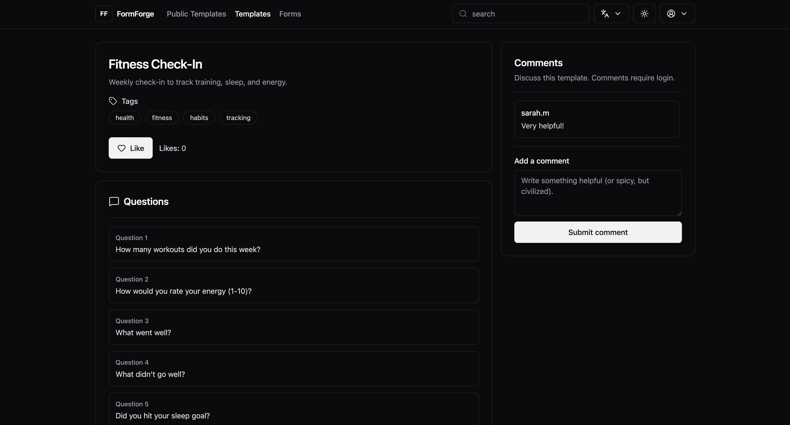
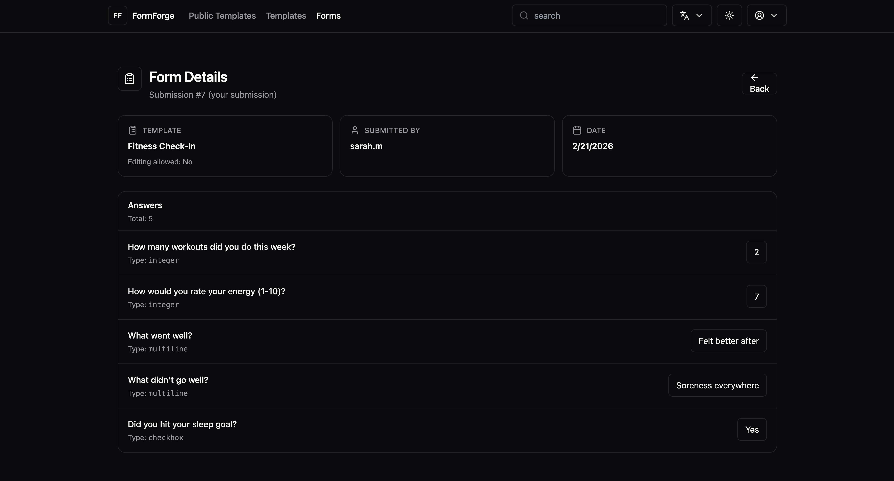

📝 FormForge (formerly Customizable Forms)

A full-stack dynamic form builder and submission platform.

Create templates. Collect submissions. Analyze responses.
Clean UI. Real users. Real features.

⸻

🌐 Live Demo

Frontend: https://customizable-forms-xi.vercel.app
Backend: Railway (Node.js + Express + MySQL)

⸻

🚀 Features

🧩 Template System
	•	Create public or private templates
	•	Add unlimited questions
	•	Multiple question types:
	•	String
	•	Multiline text
	•	Integer
	•	Checkbox
	•	Image support
	•	Tag system
	•	Enable/disable submission editing per template

📥 Submissions
	•	Users can submit forms
	•	Template owners can view all submissions
	•	Submitters can edit their own submissions (if enabled)
	•	Admin moderation
	•	Aggregated statistics:
	•	Total submissions
	•	Average numeric answers
	•	Most common text answers
	•	Checkbox true/false counts

🔎 Discovery
	•	Latest templates
	•	Top templates (ranked by likes + submissions)
	•	Search by text
	•	Search by tag
	•	Tag cloud
	•	Like system

👥 Roles
	•	User
	•	Template Owner
	•	Admin

⸻

🧠 Tech Stack

Frontend
	•	React
	•	React Router
	•	Tailwind CSS
	•	ShadCN UI
	•	Lucide Icons

Backend
	•	Node.js
	•	Express
	•	Sequelize ORM
	•	MySQL
	•	JWT Authentication
	•	CORS configuration (production + local)

☁ Deployment
	•	Frontend: Vercel
	•	Backend: Railway
	•	Database: MySQL (Railway)

⸻

🏗 Architecture Highlights
	•	Clean REST API structure
	•	Proper normalized relational modeling:
	•	Users
	•	Templates
	•	Questions
	•	Forms
	•	FormAnswers
	•	Tags (many-to-many)
	•	Likes
	•	Subquery-based ranking to avoid JOIN + LIMIT aggregation bugs
	•	Two-step fetch strategy for consistent “latest” and “top” results
	•	Role-based access control

⸻

🗄 Database Schema (Core Relationships)

User → hasMany → Template
Template → hasMany → Question
Template → hasMany → Form
Form → hasMany → FormAnswer
Template ↔ Tag (many-to-many)
Template → hasMany → Like

⸻

⚙ Running Locally

Backend
```
cd backend
npm install
npm run dev
```
Environment variables (example):
```
PORT=5001
DB_HOST=localhost
DB_USER=root
DB_PASSWORD=yourpassword
DB_NAME=formforge
JWT_SECRET=your_secret
```

⸻

Frontend
```
cd frontend
npm install
npm start
```
Environment variable:
```
REACT_APP_API_URL=http://localhost:5001
```

⸻

## 📸 Screenshots

### Home Page


### Template Details


### Form Submission


⸻

🔐 Demo Accounts

Admin
	•	Username: admin
	•	Email: admin@formforge.app
	•	Password: (demo only)

You may create your own user accounts for testing.

⸻

🎯 What This Project Demonstrates
	•	Full-stack system design
	•	Authentication + authorization
	•	Complex relational data modeling
	•	Aggregation queries & ranking logic
	•	Production deployment workflow
	•	Real-world debugging (JOIN + LIMIT edge cases)
	•	UI refactoring at scale

⸻

🔮 Future Improvements
	•	Pagination
	•	OAuth login
	•	Real-time notifications
	•	Form analytics dashboard charts
	•	Improved ranking algorithm
	•	Caching for top/latest endpoints

⸻

👤 Author

Orifkhon Kilichev
Full-stack developer building scalable tools and automation systems.
